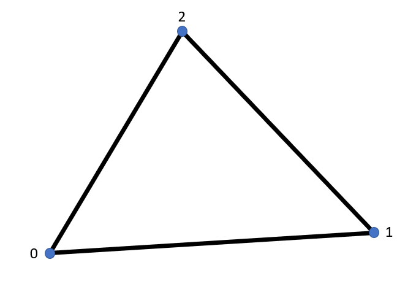
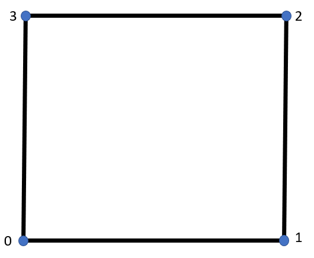
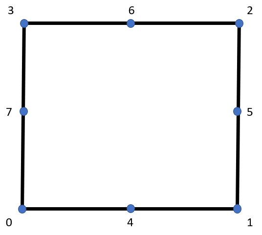
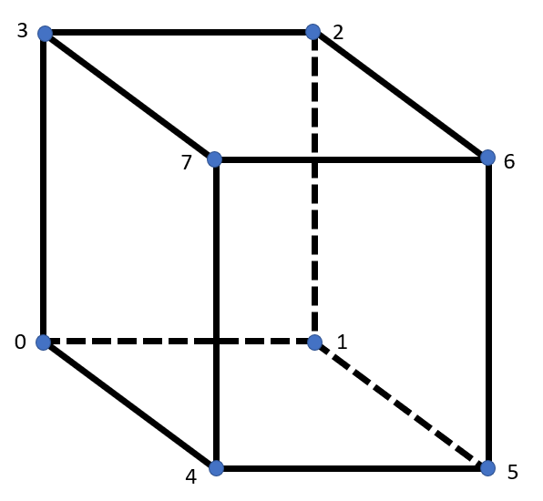
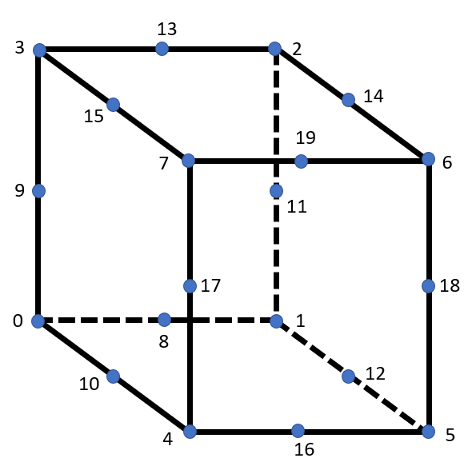

# Element technology

A summary of the basic elements og **MSolve.FEM** is provided.

## Continuum elements
This category contains structural elements with transitional olny degrees of freedom. These elements are split into two categories, two-dimensional and three-dimensioanl respectively depending on dimensionality of the model.


### Two-dimensional elements
The first  element category contains the two-dimensional elements. Below a full list of the elements can be found including their respective local node numbering, gauss integrations for stiffness and mass. The code snippet shows a sample 2D dimensional element creation. Initially, a Continuum element factory is generated which is responsible for the element definition. Its parameters are the thickness, the material and the dynamic properties which are considered constant throughout the model.
Then, the specific type of the two-dimensional element is defined by picking an element cell type and providing a list with element nodes.

```csharp
var factory = new ContinuumElement2DFactory(thickness, material, dynamicMaterial);
var quad4 = factory.CreateElement(CellType.Quad4, nodeSet);
```

#### Tri3
<p align="center">
  
</p>

For the stiffness integration of the Tri3 element an one-point integration is sufficient.

**GaussPoints for stiffness:**

| X   | Y   | Z | W   |
|-----|-----|---|-----|
| 1/3 | 1/3 | 0 | 0.5 | 

For the mass integration of the Tri3 element an three-point integration is needed.

**GaussPoints for mass:**

| X                | Y                | Z | W                      |
|------------------|------------------|---|------------------------|
| 0.66666666666667 | 0.16666666666667 | 0 | 0.5 * 0.33333333333333 |   
| 0.16666666666667 | 0.66666666666667 | 0 | 0.5 * 0.33333333333333 |   
| 0.16666666666667 | 0.16666666666667 | 0 | 0.5 * 0.33333333333333 |   

#### Tri6
<p align="center">
  
</p>

**GaussPoints for stiffness:**

For the stiffness integration of the Tri3 element an three-point integration is needed.

| X                | Y                | Z | W                      |
|------------------|------------------|---|------------------------|
| 0.66666666666667 | 0.16666666666667 | 0 | 0.5 * 0.33333333333333 |   
| 0.16666666666667 | 0.66666666666667 | 0 | 0.5 * 0.33333333333333 |   
| 0.16666666666667 | 0.16666666666667 | 0 | 0.5 * 0.33333333333333 |  

For the mass integration of the Tri3 element an three-point integration is needed.

**GaussPoints for mass:**

| X                | Y                | Z | W                      |
|------------------|------------------|---|------------------------|
| 0.44594849091597 | 0.44594849091597 | 0 | 0.5 * 0.22338158967801 |
| 0.44594849091597 | 0.10810301816807 | 0 | 0.5 * 0.22338158967801 |
| 0.10810301816807 | 0.44594849091597 | 0 | 0.5 * 0.22338158967801 |
| 0.09157621350977 | 0.09157621350977 | 0 | 0.5 * 0.10995174365532 |
| 0.09157621350977 | 0.81684757298046 | 0 | 0.5 * 0.10995174365532 |
| 0.81684757298046 | 0.09157621350977 | 0 | 0.5 * 0.10995174365532 | 

#### Quad4
<p align="center">
  
</p>
In case of quadrilateral elements the same Gauss points are used for both stiffness and mass.

**GaussPoints for stiffness and mass:**

| X                            | Y                            | Z | W |
|------------------------------|------------------------------|---|---|
| -0.5773502691896257645091488 | -0.5773502691896257645091488 | 0 | 1 |
| 0.5773502691896257645091488  | -0.5773502691896257645091488 | 0 | 1 |
| -0.5773502691896257645091488 | 0.5773502691896257645091488  | 0 | 1 |
| 0.5773502691896257645091488  | 0.5773502691896257645091488  | 0 | 1 |

#### Quad8
<p align="center">
  
</p>

**GaussPoints for stiffness and mass:**

| X                           | Y                            | Z | W             |
|-----------------------------|------------------------------|---|---------------|
| -0.774596669241483377035853 | -0.7745966692414833770358531 | 0 | 0.3086419753  |
| -0.774596669241483377035853 | 0.0                          | 0 | 0.49382716049 |
| -0.774596669241483377035853 | 0.7745966692414833770358531  | 0 | 0.3086419753  |
| 0.0                         | -0.7745966692414833770358531 | 0 | 0.3086419753  |
| 0.0                         | 0.0                          | 0 | 0.79012345679 |
| 0.0                         | 0.7745966692414833770358531  | 0 | 0.3086419753  |
| 0.7745966692414833770358531 | -0.7745966692414833770358531 | 0 | 0.3086419753  |
| 0.7745966692414833770358531 | 0.0                          | 0 | 0.49382716049 |
| 0.7745966692414833770358531 | 0.7745966692414833770358531  | 0 | 0.3086419753  |


#### Quad9
<p align="center">
  
</p>

**GaussPoints for stiffness and mass:**

| X                           | Y                            | Z | W             |
|-----------------------------|------------------------------|---|---------------|
| -0.774596669241483377035853 | -0.7745966692414833770358531 | 0 | 0.3086419753  |
| -0.774596669241483377035853 | 0.0                          | 0 | 0.49382716049 |
| -0.774596669241483377035853 | 0.7745966692414833770358531  | 0 | 0.3086419753  |
| 0.0                         | -0.7745966692414833770358531 | 0 | 0.3086419753  |
| 0.0                         | 0.0                          | 0 | 0.79012345679 |
| 0.0                         | 0.7745966692414833770358531  | 0 | 0.3086419753  |
| 0.7745966692414833770358531 | -0.7745966692414833770358531 | 0 | 0.3086419753  |
| 0.7745966692414833770358531 | 0.0                          | 0 | 0.49382716049 |
| 0.7745966692414833770358531 | 0.7745966692414833770358531  | 0 | 0.3086419753  |

### Three-dimensional elements
The first  element category contains the three-dimensional elements. Below a full list of the elements can be found including their respective local node numbering, gauss integrations for stiffness and mass. The code snippet shows a sample 3D dimensional element creation. 

```csharp
var factory = new ContinuumElement3DFactory(Material0, DynamicMaterial0);
var tet4 = factory.CreateElement(CellType.Tet4, NodeSet0);
```

#### Tet4
<p align="center">
  
</p>

#### Tet10
<p align="center">
  
</p>


#### Hexa8
<p align="center">
  
</p>

#### Hexa20
<p align="center">
  
</p>

#### Hexa27
<p align="center">
  
</p>

#### Wedge6
<p align="center">
  
</p>

#### Wedge15
<p align="center">
  
</p>


#### Wedge18
<p align="center">
  
</p>


#### Pyra5
<p align="center">
  
</p>


#### Pyra13
<p align="center">
  
</p>


#### Pyra14
<p align="center">
  
</p>


## Structural elements


## Special elements
## Hexa8NonLinear
```c#
public class Hexa8NonLinear : IStructuralFiniteElement, IEmbeddedHostElement
```

 Formulation of a hexaedral 8 node element for problems with material and geometric nonlinearities.
 The principle of virtual work is expressed, including the possibility that the considered body can undergo large deformations,
by use of Green-Lagrange strains anf second Piola-Kirchhoff stress in a total Lagrangian setting as follows:
$ \int_{_{ }^{0}\textrm{V}}^{ } _{0}^{t+\Delta t }S_{ij}  \delta_{0}^{t}\epsilon_{ij} d _{ }^{0}V = _{ }^{t+\Delta t }R

where 

$ _{0}^{t+\Delta t }S_{ij}
 are the components of the second Piola Kirchhoff stress tensor

$ _{0}^{t}\epsilon_{ij}
 are the components of the Green Lagrange strain tensor.

$ _{ }^{t+\Delta t }\mathbb{R} 
the external virtual work.

Evaluation of the element configuration at times 0 and t is made by a linear interpolation assumption:

$ ^{0}x_{1}=\sum_{k=1}^{N}h_{k}^{0}x_{1}^{k}, ^{0}x_{2}=\sum_{k=1}^{N}h_{k}^{0}x_{2}^{k} \\\and\\\ ^{0}x_{3}=\sum_{k=1}^{N}h_{k}^{0}x_{3}^{k},  

and

$ ^{t}x_{1}=\sum_{k=1}^{N}h_{k}^{t}x_{1}^{k}, ^{t}x_{2}=\sum_{k=1}^{N}h_{k}^{t}x_{2}^{k} \\\and\\\ ^{t}x_{3}=\sum_{k=1}^{N}h_{k}^{t}x_{3}^{k},  

respectively.

Similar relations hold for the displacement field as well:

$ ^{t}u_{1}=\sum_{k=1}^{N}h_{k}^{t}u_{1}^{k}, ^{t}u_{2}=\sum_{k=1}^{N}h_{k}^{t}u_{2}^{k} \\\and\\\ ^{t}u_{3}=\sum_{k=1}^{N}h_{k}^{t}u_{3}^{k},  

In an isoparametric analysis context the used interpolation scheme is:

```c#
public class InterpolationHexa8Reverse: IsoparametricInterpolation3DBase
```
with the following interpolation functions:

$ h_{1}(r,s,t)=\frac{1}{8}(1+r)(1+s)(1+t)
$ h_{2}(r,s,t)=\frac{1}{8}(1-r)(1+s)(1+t)
$ h_{3}(r,s,t)=\frac{1}{8}(1-r)(1-s)(1+t)
$ h_{4}(r,s,t)=\frac{1}{8}(1+r)(1-s)(1+t)
$ h_{5}(r,s,t)=\frac{1}{8}(1+r)(1+s)(1-t)
$ h_{6}(r,s,t)=\frac{1}{8}(1-r)(1+s)(1-t)
$ h_{7}(r,s,t)=\frac{1}{8}(1-r)(1-s)(1-t)
$ h_{8}(r,s,t)=\frac{1}{8}(1+r)(1-s)(1-t)

Using the given relations derivation of the element stiffness matrix and forces in the liearized for of equilibrium equations:

$ \int_{_{ }^{0}\textrm{V}} _{0}C_{ijrs}_{0}e_{rs}\delta_{0}e_{ij} d _{ }^{0}V +
 \int_{_{ }^{0}\textrm{V}}^{ } _{0}^{t}S_{ij}  \delta \eta _{ij} d _{ }^{0}V =
 _{ }^{t+\Delta t }R - \int_{_{ }^{0}\textrm{V}}^{ } _{0}^{t}S_{ij}  \delta e_{ij} d _{ }^{0}V 

Details of these derivations can be found in ref. 1.

References :
- "Finite Element Procedures" Klaus-Jurgen Bathe, 1996 Prentice Hall, Inc. 

## Hexa8NonLinearDefGrad
```c#
public class Hexa8NonLinearDefGrad : IStructuralFiniteElement, IEmbeddedHostElement
```
Formulation of a hexaedral 8 node element for problems with material and geometric nonlinearities.
 The principle of virtual work is expressed, including the possibility that the considered body can undergo large deformations,
by use of Green-Lagrange strains anf second Piola-Kirchhoff stress in a total Lagrangian setting as follows:
$ \int_{_{ }^{0}\textrm{V}}^{ } _{0}^{t+\Delta t }S_{ij}  \delta_{0}^{t}\epsilon_{ij} d _{ }^{0}V = _{ }^{t+\Delta t }R

and not in terms of the First Piola Kirchhoff stress tensor and the deformation gradient as the name of the class may imply.
Actually the deformation gradient is used in this hexa 8 element implementation for the update of the material state,
so that it can be used with material laws expressed in terms of it (for example: multiplicative elastoplastic material models
and other).

## Shell8NonLinear
```c#
public class Shell8NonLinear : IStructuralFiniteElement
```

The element behaviour is based on the assumptions that, straight line defined by nodal director vectors (which, usually, give lines that in the
original configurationare close to normal to the midsurface of the shell) remain straight during the element deformations (but not nesessarily normal to the midsurfaec of
the shell) and that no transverse normal stress is developed in the dorections of the director vectors. 
The resulting constitutive matrix is given as (See ref. 1 Bathe):

 To account for material and geometric nonlinearities the principle of virtual work is expressed, 
by use of Green-Lagrange strains anf second Piola-Kirchhoff stress in a total Lagrangian setting as follows:
$ \int_{_{ }^{0}\textrm{V}}^{ } _{0}^{t+\Delta t }S_{ij}  \delta_{0}^{t}\epsilon_{ij} d _{ }^{0}V = _{ }^{t+\Delta t }R

where 

$ _{0}^{t+\Delta t }S_{ij}
 are the components of the second Piola Kirchhoff stress tensor

$ _{0}^{t}\epsilon_{ij}
 are the components of the Green Lagrange strain tensor.

$ _{ }^{t+\Delta t }\mathbb{R} 
the external virtual work.

Evaluation of the element configuration at times 0 and t is made as:

$ ^{0}x_{i}=\sum_{k=1}^{N}h_{k}^{0}x_{i}^{k}+\frac{t}{2}\sum_{k=1}^{N}a_{k}h_{k}\ ^{t}V_{ni}^{k}

and

$ ^{t}x_{i}=\sum_{k=1}^{N}h_{k}^{t}x_{i}^{k}+\frac{t}{2}\sum_{k=1}^{N}a_{k}h_{k}\ ^{t}V_{ni}^{k}

respectively.

where 

$ ^{t}V_{ni}^{k}

direction vector initially normal to the shell midsurface at node k.

For the displacement field the following relation holds:

$ ^{t}u_{i}=\sum_{k=1}^{N}h_{k}^{t}u_{i}^{k}+\frac{t}{2}\sum_{k=1}^{N}a_{k}h_{k}\ (^{t}V_{ni}^{k} -^{0}V_{ni}^{k} )

An increment in the displacement is given as:

u_{i}=\sum_{k=1}^{N}h_{k}u_{i}^{k}+\frac{t}{2}\sum_{k=1}^{N}a_{k}h_{k}\ V_{ni}^{k}

where:

$  V_{n}^{k}=- ^{t}V_{2}^{k}\alpha_{k} + ^{t}V_{1}^{k}\beta_{k}-\frac{1}{2}(\alpha_{k}^{2}+\beta_{k}^{2})^{t}V_{n}^{k}

depends on rotations 
$ \alpha_{k}
$ \beta_{k}

about the vectors 
$ ^{t}V_{1}^{k}
$ ^{t}V_{2}^{k}


In an isoparametric analysis context the used interpolation scheme for the midsurface is:

```c#
public class InterpolationShell8 : IsoparametricInterpolation3DBase
```
with the following interpolation functions:

$ h_{1}(r,s)=\frac{1}{4}(1+r)(1+s) -\frac{1}{2}h_{5}(r,s)-\frac{1}{2}h_{8}(r,s)
$ h_{2}(r,s)=\frac{1}{4}(1-r)(1+s) -\frac{1}{2}h_{5}(r,s)-\frac{1}{2}h_{6}(r,s)
$ h_{3}(r,s)=\frac{1}{4}(1-r)(1-s) -\frac{1}{2}h_{6}(r,s)-\frac{1}{2}h_{7}(r,s)
$ h_{4}(r,s)=\frac{1}{4}(1+r)(1-s) -\frac{1}{2}h_{7}(r,s)-\frac{1}{2}h_{8}(r,s)
$ h_{5}(r,s)=\frac{1}{2}(1-r^{2})(1+s) 
$ h_{6}(r,s)=\frac{1}{2}(1-s^{2})(1-r) 
$ h_{7}(r,s)=\frac{1}{2}(1-r^{2})(1-s) 
$ h_{8}(r,s)=\frac{1}{2}(1-s^{2})(1+r) 

Using the given relations derivation of the element stiffness matrix and forces in the liearized for of equilibrium equations:

$ \int_{_{ }^{0}\textrm{V}} _{0}C_{ijrs}_{0}e_{rs}\delta_{0}e_{ij} d _{ }^{0}V +
 \int_{_{ }^{0}\textrm{V}}^{ } _{0}^{t}S_{ij}  \delta \eta _{ij} d _{ }^{0}V =
 _{ }^{t+\Delta t }R - \int_{_{ }^{0}\textrm{V}}^{ } _{0}^{t}S_{ij}  \delta e_{ij} d _{ }^{0}V 

References :
- "Finite Element Procedures" Klaus-Jurgen Bathe, 1996 Prentice Hall, Inc. 

## CohesiveShell8ToHexa20
Cohesive elements of class:
```c#
public class CohesiveShell8ToHexa20 : IStructuralFiniteElement, IEmbeddedElement
```
can be used for the modeling of cohesive interaction between parts modeled with hexa20 and Shell8 elements.

The contribution of this interaction in the weak form of the problem is given as:

$ \int_{\Gamma_{c}}^{ }  \bar{T}_{i}(\delta u^{hexa}-\delta u^{shell}) d\Gamma

where:

$ \Gamma_{c}

is the predefined cohseive interface

$ \bar{T}_{i}

is the tractions of on the reference side of the interfaces $  \bar{T}_{i}= \bar{T}_{i}^{hexa}

$ \delta u^{hexa}
variation of the displacement on the surface of hexa elements

$ \delta u^{shell}
variation of the displacement on the upper or lower surface of shell elements.

Tractions $ \bar{T}_{i} 
are expressed in a local coordinate system defined by axes tangential and normal to the midsurface $ \bar{\Gamma}_{i} that lies
between the surfaces of the shell and the hexa elements and coincides with their interface at the undeformed configuration:
$ \int_{\bar{\Gamma }}^{ }  \bar{T}_{i}(\delta u^{hexa}-\delta u^{shell}) d\bar{\Gamma }=\int_{\bar{\Gamma }}^{ }  R_{ij}T_{i}(\delta u^{hexa}-\delta u^{shell}) d\bar{\Gamma }

For a given cohesive element the approximation of the displacement field for the $ \Gamma^{hexa} 
surface can be defined as:

$ ^{t}u_{1}=\sum_{k=1}^{N}h_{k}^{t}u_{1}^{k}, ^{t}u_{2}=\sum_{k=1}^{N}h_{k}^{t}u_{2}^{k} \\\and\\\ ^{t}u_{3}=\sum_{k=1}^{N}h_{k}^{t}u_{3}^{k},  

and the approximation of the displacement field for the $ \Gamma^{shell} 
surface can be defined as:

$ ^{t}u_{i}=\sum_{k=1}^{N}h_{k}^{t}u_{i}^{k}+\frac{t}{2}\sum_{k=1}^{N}a_{k}h_{k}\ (^{t}V_{ni}^{k} -^{0}V_{ni}^{k} )

for $ t= \pm 1

Using the given relations that hold for the displacement field of the two surfaces derivation of the element stiffness matrix and forces is straightforward.

## Shell8DirectionVectorUtilities
ASssuming that a shell structure can undergo large deformations and rotations, the updated configuration of the direction vectors,
after imposing a finite rotation increment can be calculated using appropriate relations (see ref. 1)

The rotation matrix to be used to this purpose is given as:

$ T(\theta )=I_{3}+ \frac{sin(\theta)}{\theta}S+\frac{1}{2}(\frac{sin(\theta/2)}{\theta/2})^{2} S^{2}

where

$S= \begin{bmatrix}
0 & -\psi & \chi \\
\psi & 0 & -\phi\\
-\chi & \phi & 0\\

\end{bmatrix}

and 
$\theta_{vec}= \begin{bmatrix}

\phi & \chi & \psi\\

\end{bmatrix}

= \begin{bmatrix}

\alpha & \beta & 0\\

\end{bmatrix}

the imposed rotation vector components that correspond to ratations about the normal vectors to the midsurface of the shell and about the direction vector at the considered node.

## Hexa8LandNLTranslationTransformationVector
For the connection of elements of diferrent types appropriated kinematic relations shoud be set up between the nodes of those elements.
The embedded element dependence is  considered here and each node of the embedded element is kinematicaly depended on the nodes of the
host element through the folllowing relations:

$ ^{t}x_{emb,i}=\sum_{k=1}^{N}h_{host,k}  { }^{t}x_{i}^{k}
